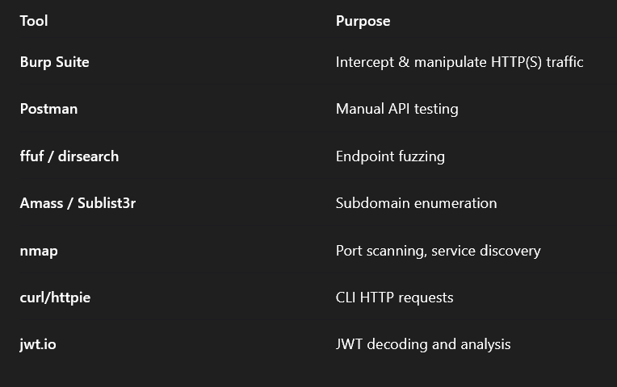

API Recon is the initial and foundational phase in API testing and security assessment. The goal is to gather comprehensive information about the API's structure, functionality, and behavior to uncover its attack surface—the total sum of all possible points where an unauthorized user could try to access or extract data.

Below is a detailed breakdown of the steps and strategies involved in effective API reconnaissance:

1. Discovering API EndpointsWhat are Endpoints?
API endpoints are URLs exposed by the API that perform specific operations (e.g., CRUD—Create, Read, Update, Delete) on resources.

Methods of Endpoint Discovery:
a. Static Discovery:

    Documentation Review: Check Swagger/OpenAPI specs, Postman collections, or developer docs.

    JavaScript & Source Code Analysis: Look for API calls in front-end code (JS files, HTML forms).

    Mobile App Reversing: Use tools like APKTool or MobSF to reverse engineer mobile apps and inspect API calls.

    Browser Dev Tools: Observe XHR/Fetch requests in the browser network tab.

b. Dynamic Discovery:

    Burp Suite/Proxy Tools: Intercept API traffic while using the application.

    Fuzzer Tools: Use tools like ffuf, dirsearch, or API-specific fuzzers to brute-force endpoint paths.

    Subdomain Enumeration: Tools like Amass, Subfinder can uncover API subdomains (e.g., api.example.com).
 2. Authentication & Authorization Mechanisms
Identify:

    Does the API require authentication (e.g., OAuth2, JWT, API Keys)?

    How does it handle authorization? Are there Role-Based Access Controls (RBAC)?

    Can you bypass these with insecure defaults, token reuse, or privilege escalation?

Test:

    Missing or weak authentication

    Token leakage or reuse

    Insecure token storage (e.g., in URL or localStorage)

    Improper session expiration or revocation

3. Supported HTTP Methods

Each endpoint may allow multiple methods:

    GET: Read data

    POST: Create new data

    PUT/PATCH: Update data

    DELETE: Remove data

    OPTIONS: Discover methods supported by an endpoint

How to Test:

    Use tools like curl, Postman, or Burp Repeater to try unsupported or risky methods (e.g., sending a DELETE request to a read-only endpoint).

    Check for HTTP Method Overriding vulnerabilities (e.g., via _method=DELETE).

4. Input Data Parameters
Things to Identify:

    Required vs Optional parameters

    Data types (string, integer, array, etc.)

    Input validation (length, format, regex)

    Nested or complex objects (e.g., JSON bodies)

Techniques:

    Analyze API docs or use Swagger Inspector

    Observe request/response in tools like Burp Suite

    Fuzz parameters with special characters to test for injection flaws

5. Content Types and Media Formats
Test for:

    Content negotiation (Accept and Content-Type headers)

    Supported formats: JSON, XML, YAML, etc.

    Potential content-type confusion vulnerabilities (e.g., XML when only JSON is expected)

6. Rate Limiting and Throttling
Why Important?

Rate limits protect APIs from abuse and DDoS attacks. Absence or poor implementation could lead to:

    Brute force attacks

    Enumeration attacks

    Resource exhaustion

Test:

    Send high-volume requests and observe 429 Too Many Requests or lack thereof

    Try using different IPs or tokens to evade limits

7. Error Handling and Response Analysis
Look for:

    Verbose error messages (e.g., stack traces, database errors)

    Information disclosure (e.g., internal IPs, environment names)

    Inconsistent status codes (e.g., 200 OK for failed login)

    

### 📊 IAM Capabilities vs. Boundaries

| **Aspect**               | **IAM Can Do**                                                   | **IAM Cannot Do**                                               |
|--------------------------|------------------------------------------------------------------|------------------------------------------------------------------|
| **Identity Management**  | Create users, groups, roles                                      | Control OS-level actions on AWS resources                       |
| **Access Control**       | Define fine-grained permissions via policies                    | Monitor or detect insider threats                               |
| **Temporary Credentials**| Issue temporary tokens using IAM roles + STS                    | Enforce session timeout for long-term IAM users                 |
| **Policy Enforcement**   | Attach identity/resource policies, conditions, tags             | Override service defaults or hard limits                        |
| **Cross-Account Access** | Enable role assumption across accounts                          | Restrict actions of the root user via IAM policies              |
| **Federated Identity**   | Allow SSO access with external IdPs via IAM Identity Center     | Audit or visualize access natively (needs CloudTrail/Analyzer)  |
| **Least Privilege**      | Enforce minimum access using custom policies                    | Encrypt data or manage keys (handled by AWS KMS)                |
| **Scope of Control**     | Works across most AWS services with IAM integration             | Control network-level access (use VPC, SGs, NACLs instead)      |

